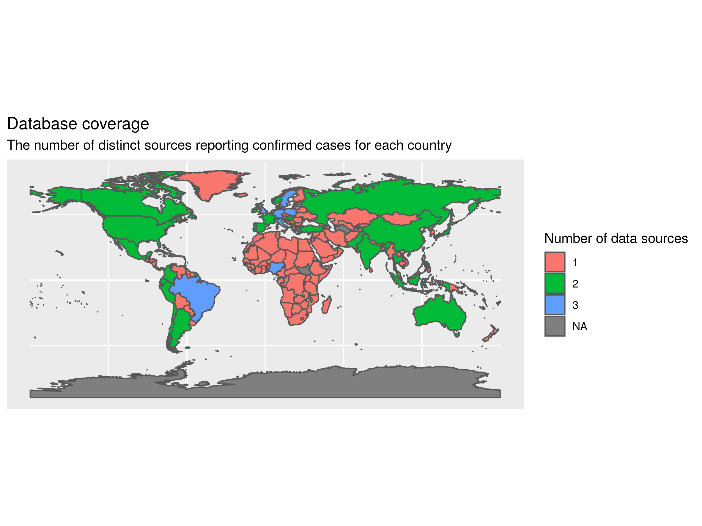

# Oxford COVID-19 (OxCOVID19) Data Repository 

**OxCOVID19 Database** is a large, single-centre, multimodal database consisting of information relating to COVID-19 pandemic. 

**OxCOVID19 Project** [https://covid19.eng.ox.ac.uk/](https://covid19.eng.ox.ac.uk/)  aims to increase our understanding of the Covid-19 pandemic and elaborate possible strategies to reduce the impact on the society through the combined power of Statistical and Mathematical Modelling, and Machine Learning techniques.

---

__Cite as:__ Adam Mahdi, Piotr Błaszczyk, Paweł Dłotko, Dario Salvi, Tak-Shing Chan, John Harvey, Davide Gurnari, Yue Wu, Ahmad Farhat, Niklas Hellmer, Alexander Zarebski, Lionel Tarassenko,
<em>Oxford COVID-19 Database: multimodal data repository for understanding the global impact of COVID-19. University of Oxford</em>, 2020.

---

## Coverage and completeness

Measureing the completeness of an epidemiological database is a complex task.
The following map demonstrates how many data sources report confirmed cases in
each country. 

